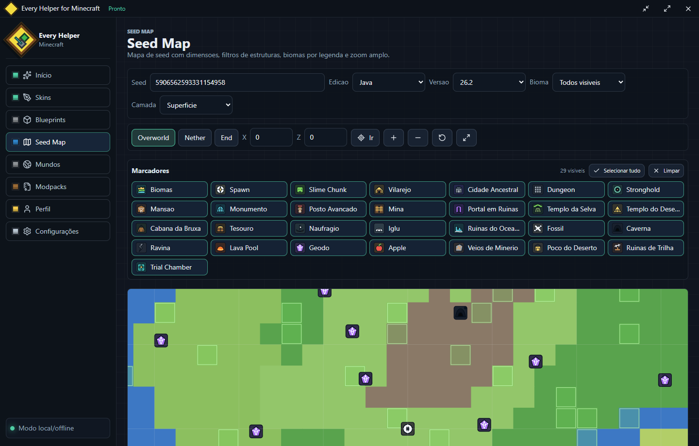
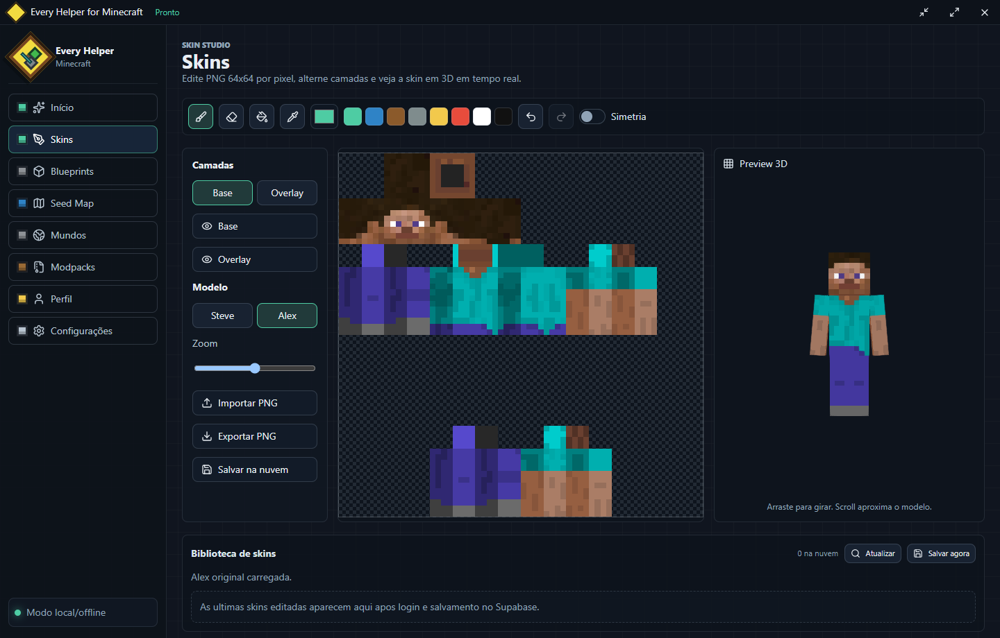
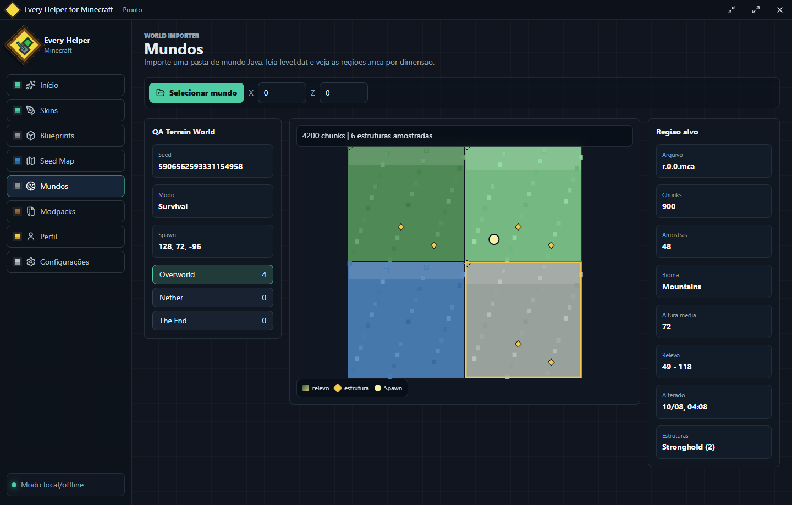

# Every Helper for Minecraft

Aplicativo desktop para Windows com ferramentas praticas para jogadores e criadores de Minecraft: skins, seed map, leitura de mundos, perfil em nuvem e integracoes opcionais.

<p align="center">
  <a href="https://github.com/MiloRuback/E-Helper-for-Minecraft/releases/latest">
    
  </a>
  <a href="README.en.md">
    
  </a>
</p>



## Canais

- `development`: versao completa, com Skins, Blueprints, Seed Map, Mundos, Modpacks, Perfil e Configuracoes.
- `stable`: versao enxuta para uso final, sem as abas Blueprints e Modpacks.
- GitHub Releases publica dois instaladores por tag: `Development` e `Stable`.

## Principais recursos

- Editor de skins 64x64 com pincel, borracha, balde, conta-gotas, camadas base/overlay, simetria, undo/redo, templates originais Steve/Alex, importacao/exportacao PNG e preview 3D via `skinview3d`.
- Biblioteca de skins em nuvem: as ultimas skins salvas ficam no Supabase por usuario e podem ser carregadas novamente no editor.
- Seed Map inspirado na experiencia do Chunkbase, com Java/Bedrock, versoes, Overworld/Nether/End, camadas Superficie/Subsolo/Abissal no Overworld, zoom de `1 px = 128 m` ate `8 px = 1 m`, filtros de estruturas e marcadores visitados.
- Importador de mundos Java com leitura de `level.dat`, regioes `.mca`, chunks amostrados, biomas, relevo por heightmap, spawn e estruturas registradas nos chunks.
- Perfil local/sincronizado com nome, bio, pronomes, avatar Minecraft e login Supabase.
- Backup/restauracao JSON local e integracao opcional com Google Drive.
- Integracao opcional Microsoft/Minecraft para buscar UUID, username, skin e avatar oficiais.
- Build desktop com Electron, React, TypeScript, Vite e `electron-builder`.

## Galeria

| Skins com biblioteca em nuvem | Mapa de mundo por chunks |
| --- | --- |
|  |  |

## Banco de dados e nuvem

O backend em nuvem usa Supabase, que combina PostgreSQL, Auth e APIs geradas automaticamente com Row Level Security.

Modelo principal:

- `profiles`: dados editaveis do perfil do usuario, avatar e dados Minecraft.
- `user_skins`: biblioteca cloud das skins salvas no editor. Cada registro guarda `user_id`, nome, PNG em `skin_data`, modelo (`standard` ou `slim`) e timestamps.
- `user_settings`: preferencias sincronizaveis do app.
- `user_worlds`, `user_blueprints`, `user_modpacks`: tabelas preparadas para dados de usuario por modulo.

Seguranca aplicada:

- RLS habilitado em todas as tabelas expostas.
- Policies por dono usando `auth.uid()`, impedindo que um usuario leia ou altere dados de outro.
- Indices por `user_id` e por `user_skins(user_id, updated_at desc)` para carregar rapidamente a biblioteca de skins.
- O cliente usa apenas publishable key. Nunca coloque service role, client secret, token pessoal ou senha em `.env`, README ou codigo do renderer.
- `.env` fica ignorado pelo Git; use `.env.example` como modelo.

## Integracoes

- Supabase: login por email/senha e sincronizacao de perfil/skins.
- Google Drive: OAuth desktop com PKCE e escopo `drive.file` para backup/restauracao JSON.
- Microsoft/Minecraft: OAuth Microsoft, Xbox Live, XSTS e Minecraft Services quando o Client ID estiver configurado.
- GitHub Releases: workflow Windows gera os instaladores Stable e Development.
- Auto-update: o app empacotado usa `electron-updater` para buscar novas versoes publicadas.

Veja detalhes em [docs/INTEGRATIONS_SETUP.md](docs/INTEGRATIONS_SETUP.md).

## Rodar localmente

```bash
npm install
npm run dev
```

## Builds

Build development:

```bash
npm run build
npm run dist
```

Build stable, sem Blueprints/Modpacks:

```bash
npm run build:stable
npm run dist:stable
```

O instalador NSIS sai em `release/`.

## Release no GitHub

Crie uma tag para disparar o workflow:

```bash
git tag v0.1.18
git push origin v0.1.18
```

O workflow `.github/workflows/release.yml` publica os instaladores:

- `Every-Helper-for-Minecraft-Development-Setup-<versao>.exe`
- `Every-Helper-for-Minecraft-Stable-Setup-<versao>.exe`

## Validacao local

QAs usadas neste projeto:

```bash
npm run build
npm run build:stable
node tools/qa/seed-map-ux.mjs
node tools/qa/skin-library-ux.mjs
node tools/qa/world-map-ux.mjs
```
