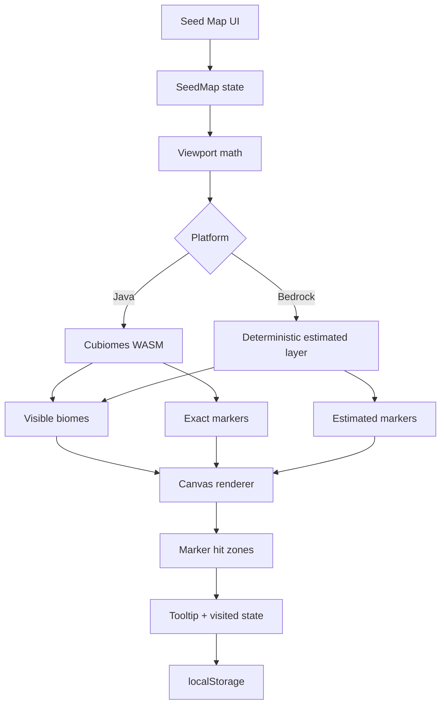
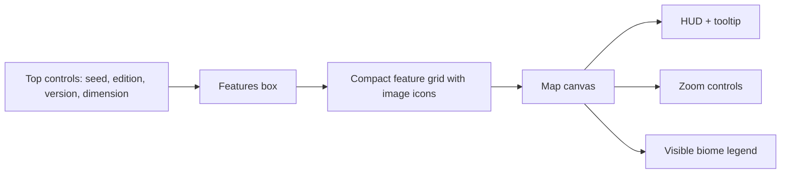
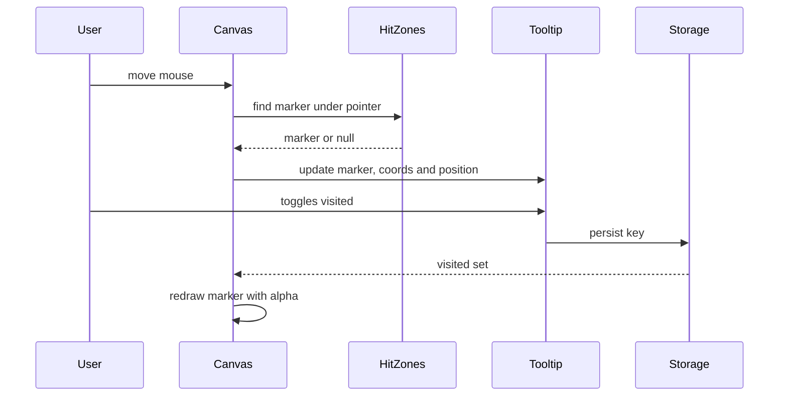

# Seed Map Chunkbase Parity Plan

Este documento define o trabalho de dev para deixar o Seed Map do Every Helper mais proximo do comportamento do Chunkbase, com icones de imagem, filtros limpos, tooltip de estruturas, estado de visitado, paleta ampla de biomas e desempenho adequado durante pan/zoom.

## Fontes De Referencia

- Chunkbase Seed Map, consultado em 2026-08-10: controles de seed, versao, dimensao, features, highlight biomes, zoom/pan e completed locations.
- Cubiomes local: motor WASM usado para Java, biomas e estruturas suportadas.
- Minecraft Wiki/Mojang Help: nomenclatura moderna dos biomas por dimensao.

## Requisitos

1. O painel de features deve ficar compacto e escaneavel, como uma caixa de filtros, sem poluir a tela.
2. Cada feature/estrutura deve ter um icone de imagem, usado no painel, no canvas e no tooltip.
3. O mapa deve suportar Java/Bedrock, versao e Overworld/Nether/End.
4. Java deve usar Cubiomes para biomas e estruturas suportadas.
5. Bedrock deve ficar claramente marcado como estimado enquanto nao houver motor Bedrock exato.
6. Ao passar o mouse em um marcador, deve aparecer um tooltip com nome, coordenadas, status exato/estimado e checkbox de visitado.
7. Ao marcar um marcador como visitado, o icone no mapa deve ficar semi-transparente e o estado deve persistir localmente por seed, plataforma, versao e dimensao.
8. O wheel em cima do mapa deve aplicar zoom no mapa e nao rolar a pagina.
9. A paleta de biomas deve cobrir muitos biomas modernos e usar cores diferenciaveis, tematicas e coerentes com a legenda.
10. A legenda deve mostrar somente biomas visiveis e cada swatch precisa existir no canvas.
11. Pan/zoom nao pode travar. O render deve ser agendado e otimizado.
12. A QA deve verificar canvas nao vazio, filtros, icones reais, tooltip, visitado, dimensoes, Bedrock estimado, legenda/canvas, wheel sem scroll e desempenho basico.

## Fluxo De Dados



## Organizacao Visual



### Layout

- Linha 1: Seed, Edicao, Versao, Dimensao.
- Linha 2: X, Z, Go, zoom in/out, reset, expandir.
- Features: caixa compacta com botoes menores, icone 24px, texto curto e badge `C` apenas para Java exato.
- Canvas: ocupa a area principal, com HUD discreto e tooltip flutuante.
- Legenda: abaixo do canvas, baseada nos biomas realmente desenhados.

## Icones

Os icones serao SVGs proprios do projeto em `src/renderer/assets/seed-icons/`. Nao copiar assets do Chunkbase. Cada SVG deve:

- Ter `viewBox="0 0 32 32"`.
- Ser legivel em 18px e 28px.
- Usar poucos blocos/pixels para manter performance.
- Representar visualmente a feature sem depender de texto.

Categorias:

- World layers: biomes, spawn, slime chunk.
- Overworld structures: village, ancient city, dungeon, stronghold, mansion, monument, outpost, mineshaft, ruined portal, temples, witch hut, treasure, shipwreck, igloo, ocean ruins, fossil, cave, ravine, lava pool, geode, apple, ore veins, desert well, trail ruins, trial chamber.
- Nether: fortress, bastion, ruined portal nether.
- End: end city, gateway, island.

## Tooltip De Marcador



Tooltip conteudo:

- Icone de imagem.
- Nome da estrutura.
- Coordenadas X/Z.
- Tipo de dado: Cubiomes exato, estimado ou manual.
- Checkbox `Visitado`.

Persistencia:

```text
ehm:seedMapVisited:v1:<platform>:<version>:<dimension>:<seed>
```

Valor:

```json
{
  "village:128:64": true,
  "geode:-304:192": true
}
```

## Render E Desempenho

Problemas atuais:

- O canvas redesenha diretamente em cada mudanca de estado.
- O `onPointerMove` chama `setOffset` muitas vezes por segundo.
- Hit-test de marcadores ainda nao existe.
- O wheel pode acionar scroll da pagina em alguns navegadores se o listener passivo interferir.

Plano:

- Usar `requestAnimationFrame` para agrupar pan/zoom.
- Usar refs para `offset`, `zoom`, `markers` e `hitZones`, reduzindo renders React durante pan.
- Usar cache por viewport discretizado para biomas fallback.
- Nao desenhar texto dentro do marcador no canvas.
- Usar `ImageBitmap` ou `HTMLImageElement` cacheado para icones.
- Registrar wheel nativo no canvas com `{ passive: false }` para garantir `preventDefault`.
- Limitar markers estimados quando o zoom esta muito aberto.

## Paleta De Biomas

Regras:

- Cada biome id deve ter cor propria quando conhecido.
- Biomas parecidos podem estar na mesma familia, mas precisam diferir o suficiente para a legenda ser util.
- Oceanos usam azuis diferenciados por temperatura/profundidade.
- Florestas usam verdes distintos por densidade/tipo.
- Nether usa vermelho, roxo, ciano e cinza de alto contraste.
- End usa amarelos/olivas/lilas palidos.
- Biomas desconhecidos caem em cor derivada do nome para evitar tudo verde.

## QA Obrigatoria

Automatizada em `tools/qa/seed-map-ux.mjs`:

1. Canvas visivel, nao vazio e com diversidade de cores.
2. Features visiveis com icones `img`.
3. Select all e clear funcionam.
4. Nether e End trocam lista de features e renderizam.
5. Bedrock mostra modo estimado e nao badge Cubiomes.
6. Primeira cor da legenda existe no canvas.
7. Wheel em cima do canvas nao altera `scrollTop` da pagina.
8. Hover em marcador abre tooltip com coordenadas e checkbox.
9. Checkbox de visitado deixa o marcador semi-transparente e persiste apos redraw.
10. Pan rapido mantem tempo medio de frame aceitavel.

Manual:

- Conferir screenshot desktop 1440x920.
- Conferir viewport 390x844.
- Conferir que textos nao estouram nos botoes de feature.
- Conferir que tooltip nao fica fora da area visivel do mapa.

## Limites Honestamente Expostos

- Cubiomes local e usado para Java. Bedrock continua estimado enquanto nao houver gerador Bedrock exato no projeto.
- Algumas features do proprio Chunkbase sao documentadas como nao 100% precisas, como dungeons, geodes, apples e alguns portais/ruins.
- Os icones sao autorais do Every Helper, inspirados por conceitos do Minecraft, sem copiar assets do Chunkbase.

